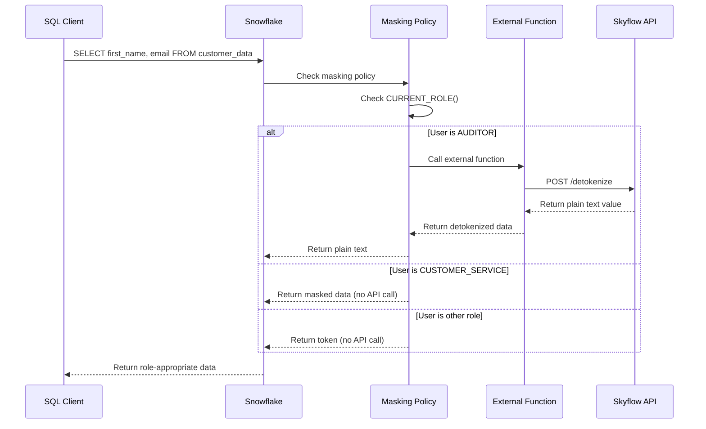

# Skyflow for Snowflake: Enterprise PII & Sensitive Data Protection

This solution provides secure data tokenization and detokenization capabilities in Snowflake to protect PII and other sensitive data using Skyflow's Data Privacy Vault services. Built with Snowflake external functions, masking policies, and role-based access control (RBAC) for maximum performance and seamless integration with Snowflake's security features.

## Table of Contents

- [Quick Start](#quick-start)
- [Architecture](#architecture)
    - [Flow Overview](#flow-overview)
    - [Key Components](#key-components)
- [Configuration](#configuration)
    - [Prerequisites](#prerequisites)
    - [Snowflake Permissions Required](#snowflake-permissions-required)
    - [Project Structure](#project-structure)
    - [Environment Variables (.env.local)](#environment-variables-envlocal)
- [Development](#development)
    - [Adding New PII Columns](#adding-new-pii-columns)
    - [CLI Features](#cli-features)
    - [Dashboard Integration](#dashboard-integration)
    - [Cleanup](#cleanup)

## Quick Start

1. **Clone and Configure**:
   ```bash
   git clone <repository>
   cd Snowflake
   cp .env.local.example .env.local
   ```

2. **Set Environment Variables** - Edit `.env.local` with your credentials:
   ```bash
   # Snowflake Configuration
   SNOWFLAKE_ACCOUNT=your-account.region.cloud
   SNOWFLAKE_USER=your-username
   
   # Authentication - use EITHER password OR PAT token
   SNOWFLAKE_PASSWORD=your-password
   # SNOWFLAKE_PAT_TOKEN=your-pat-token    # Alternative to password
   
   SNOWFLAKE_WAREHOUSE=your-warehouse
   SNOWFLAKE_DATABASE=your-database
   SNOWFLAKE_SCHEMA=PUBLIC
   SNOWFLAKE_ROLE=SYSADMIN
   
   # Skyflow Configuration  
   SKYFLOW_VAULT_URL=https://your-vault-url
   SKYFLOW_PAT_TOKEN=eyJhbGci...your-pat-token
   SKYFLOW_VAULT_ID=your-vault-id
   SKYFLOW_TABLE=pii
   ```

3. **Install Dependencies & Deploy**:
   ```bash
   pip install -r requirements.txt
   python setup.py create demo
   ```

   This creates:
   - ✅ Snowflake Database: `demo_database` 
   - ✅ Required Snowflake roles (AUDITOR, CUSTOMER_SERVICE, MARKETING)
   - ✅ Sample table with tokenized records
   - ✅ Snowflake secrets and API integrations
   - ✅ External functions for detokenization (mock implementation)
   - ✅ Masking policies on 6 PII columns with role-based access
   - ✅ Customer insights dashboard views

4. **Test Role-Based Access**:
   ```sql
   -- Query returns different results based on your role
   USE DATABASE demo_database;
   SELECT first_name, last_name, email, phone_number FROM demo_customer_data LIMIT 3;
   
   -- Check your current role
   SELECT 
       CURRENT_USER() AS user,
       CURRENT_ROLE() AS role,
       CURRENT_WAREHOUSE() AS warehouse;
   
   -- Test role switching (must have appropriate grants)
   USE ROLE AUDITOR;
   SELECT first_name FROM demo_customer_data LIMIT 1; -- Should see plain text
   
   USE ROLE CUSTOMER_SERVICE; 
   SELECT first_name FROM demo_customer_data LIMIT 1; -- Should see masked data
   ```

## Key Benefits

- **🚀 Native Snowflake Performance**: Built with Snowflake external functions and SQL UDFs
- **🔒 Role-Based Security**: Automatic data masking via Snowflake masking policies and RBAC
- **⚡ Serverless Ready**: Works seamlessly with Snowflake's serverless architecture
- **🔧 Easy Integration**: Native Snowflake functions work with any SQL client or tool
- **📊 Real-time Access Control**: Instant role-based access via `CURRENT_ROLE()`
- **🛡️ Graceful Error Handling**: Returns tokens on API failures to ensure data availability

## Role-Based Data Access

The solution supports three role-based access levels:

| Role | Snowflake Role | Data Visibility | Example Output |
|------|----------------|----------------|----------------|
| **Auditor** | `AUDITOR` | **Plain text** (detokenized) | `Jonathan` |
| **Customer Service** | `CUSTOMER_SERVICE` | **Masked** (partial hiding) | `J****an` |
| **Marketing** | `MARKETING` | **Token** (no access) | `4532-8765-9abc-def0` |

### Masking Policy Behavior

```sql
-- Same query, different results based on role:
USE DATABASE demo_database;
SELECT customer_id, first_name, email FROM demo_customer_data LIMIT 1;

-- AUDITOR sees:           CUST00001 | Jonathan | jonathan.anderson@example.com
-- CUSTOMER_SERVICE sees:  CUST00001 | J****an  | j****an.a*****on@example.com  
-- MARKETING sees:         CUST00001 | TOKEN_xyz | TOKEN_abc
```

**Role Switching**: Snowflake role changes take effect immediately within the session.

## Architecture

### Flow Overview



### Key Components

- **API Integration**: `SKYFLOW_API_INTEGRATION` → External API Gateway for Skyflow
- **External Functions**: `{prefix}_skyflow_detokenize()` - handles Skyflow API calls
- **Masking Policies**: `{prefix}_pii_mask` - applied at column level with role-based logic
- **Role-based UDF**: `{prefix}_skyflow_conditional_detokenize()` - orchestrates role logic

## Python CLI Usage

```bash
# Create integration
python setup.py create demo

# Verify integration  
python setup.py verify demo

# Destroy integration
python setup.py destroy demo

# Get help
python setup.py --help
```

## Configuration

### Prerequisites

1. **Snowflake Account** with appropriate role hierarchy configured
2. **Skyflow Account** with valid PAT token and configured vault

### Snowflake Permissions Required

The user running this solution needs the following Snowflake permissions:

#### Account-Level Permissions
- **SYSADMIN** OR **ACCOUNTADMIN** (to create databases and manage account resources)

#### Required Grants
| Object | Permission | Purpose |
|--------|------------|---------|
| **Account** | `CREATE DATABASE` | Creating `{prefix}_database` |
| **Database** | `CREATE SCHEMA`, `USAGE` | Schema and object creation |
| **Schema** | `CREATE TABLE`, `CREATE FUNCTION`, `CREATE MASKING POLICY` | Object creation |
| **Warehouse** | `USAGE` | Query execution |

#### Required Roles ✨ **Auto-Created**
The solution automatically creates these Snowflake roles during deployment:
- `AUDITOR` - Users who see detokenized (plain text) data
- `CUSTOMER_SERVICE` - Users who see masked data (e.g., `J****an`)  
- `MARKETING` - Users who see only tokens

**✅ No Manual Setup Required**: The `python setup.py create demo` command automatically:
- Creates all required roles if they don't exist
- Grants database access permissions to each role  
- Sets up proper access control for the integration

#### Role Assignment (After Setup)
```sql
-- Grant roles to users (run as SECURITYADMIN or user with privileges)
GRANT ROLE AUDITOR TO USER your_auditor_user;
GRANT ROLE CUSTOMER_SERVICE TO USER your_service_user; 
GRANT ROLE MARKETING TO USER your_marketing_user;

-- Allow yourself to test different roles
GRANT ROLE AUDITOR TO USER your_current_user;
GRANT ROLE CUSTOMER_SERVICE TO USER your_current_user;
```


#### Permission Validation
Test your permissions before deployment:
```bash
# Test configuration and permissions
python setup.py config-test

# This validates:
# - Snowflake connection authentication
# - Database and schema access
# - Warehouse connectivity
# - Required file permissions
```

#### Common Permission Issues
| Error | Cause | Solution |
|-------|--------|----------|
| `PERMISSION_DENIED: User does not have CREATE DATABASE` | Missing SYSADMIN rights | Grant `SYSADMIN` or `ACCOUNTADMIN` role |
| `INVALID_STATE: Cannot create secret` | Missing secrets permissions | Ensure role has `CREATE SECRET` privilege |
| `PERMISSION_DENIED: CREATE API INTEGRATION` | Missing integration permissions | Ensure role has `CREATE INTEGRATION` privilege |
| `Role 'AUDITOR' not found` | Roles not created yet | Run `python setup.py create demo` to create roles automatically |

### Project Structure

```text
skyflow_snowflake/           # Main Python package
├── cli/                     # CLI commands
├── config/                  # Configuration management  
├── snowflake_ops/           # Snowflake operations
├── utils/                   # Utility functions
└── templates/               # Deployment templates
    ├── sql/                 # SQL definitions (setup/destroy/verify)
    ├── notebooks/           # Stored procedure examples
    └── dashboards/          # Pre-built analytics views
```

### Environment Variables (.env.local)

```bash
# Snowflake Connection
SNOWFLAKE_ACCOUNT=your-account.region.cloud
SNOWFLAKE_USER=your-username

# Authentication - use EITHER password OR PAT token
SNOWFLAKE_PASSWORD=your-password
# SNOWFLAKE_PAT_TOKEN=your-pat-token    # Alternative to password

SNOWFLAKE_WAREHOUSE=your-warehouse
SNOWFLAKE_DATABASE=your-database
SNOWFLAKE_SCHEMA=PUBLIC
SNOWFLAKE_ROLE=SYSADMIN

# Skyflow Integration  
SKYFLOW_VAULT_URL=https://your-vault.vault.skyflowapis.com
SKYFLOW_VAULT_ID=your-vault-id
SKYFLOW_PAT_TOKEN=eyJhbGci...your-pat-token
SKYFLOW_TABLE=pii
SKYFLOW_TABLE_COLUMN=pii_values
SKYFLOW_BATCH_SIZE=25

# Role Mappings (used by masking policies)
PLAIN_TEXT_GROUPS=auditor           # See real data
MASKED_GROUPS=customer_service      # See masked data (e.g., J****an)  
REDACTED_GROUPS=marketing           # See tokens only
```

#### Snowflake Resources Setup

The solution creates these Snowflake resources:

- **Database**: `{prefix}_database` with schema
- **Roles**: AUDITOR, CUSTOMER_SERVICE, MARKETING with appropriate permissions
- **Secrets**: Skyflow credentials stored as Snowflake secrets
- **API Integration**: `SKYFLOW_API_INTEGRATION` for external functions
- **External Functions**: For Skyflow API communication
- **Masking Policies**: Applied to sensitive columns with role-based logic
- **Stored Procedures**: For tokenization operations

## Development

### Adding New PII Columns

1. **Update tokenization**: Edit `skyflow_snowflake/snowflake_ops/notebooks.py` to include new columns in stored procedures
2. **Add masking policies**: Edit `skyflow_snowflake/templates/sql/setup/apply_column_masks.sql`
3. **Redeploy**: `python setup.py recreate demo`

#### CLI Features

- **Snowflake Connector Integration**: Uses official Snowflake Python connector
- **Better Error Handling**: Detailed error messages and automatic retry logic
- **Progress Indicators**: Visual progress bars for long-running operations
- **Rich Output**: Colored, formatted output for better readability

### Dashboard Integration

The included dashboard demonstrates real-time role-based data access with customer insights, purchase patterns, and consent tracking. The dashboard URL is provided after setup completion.

### Cleanup

```bash
python setup.py destroy demo
```

Removes all Snowflake resources: database, roles, API integrations, secrets, functions, masking policies, stored procedures, and dashboard views.

## Support

- **Skyflow Documentation**: [docs.skyflow.com](https://docs.skyflow.com)
- **Snowflake Documentation**: [docs.snowflake.com](https://docs.snowflake.com/)
- **GitHub Issues**: Please use the repository issue tracker

## License

This project is provided as sample code for demonstration purposes. Not recommended for production deployment without further review, testing, and hardening.
