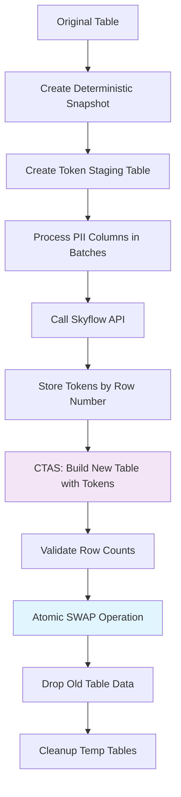

# Skyflow for Snowflake: Enterprise PII & Sensitive Data Protection

This solution provides secure data tokenization and detokenization capabilities in Snowflake to protect PII and other sensitive data using Skyflow's Data Privacy Vault services. Built with Snowflake external functions, masking policies, and role-based access control (RBAC) for maximum performance and seamless integration with Snowflake's security features.

**✅ Production-Ready Features:**
- **High-Performance Tokenization**: CTAS+SWAP atomic tokenization approach with zero downtime
- **Role-Based Data Access**: Automatic detokenization, masking, or redaction based on Snowflake roles
- **Unified Architecture**: Single external function handles all redaction modes (PLAIN_TEXT, MASKED, REDACTED)  
- **Prefixed Resource Management**: Avoid naming conflicts with environment-specific prefixes
- **Scalable Batch Processing**: Configurable batch size with efficient API call optimization
- **Comprehensive Validation**: Built-in role access testing during setup
- **Complete Cleanup**: Thorough destroy command removes all resources

## Table of Contents

- [Quick Start](#quick-start)
- [Architecture](#architecture)
    - [Flow Overview](#flow-overview)
    - [Key Components](#key-components)
- [Configuration](#configuration)
    - [Prerequisites](#prerequisites)
    - [Snowflake Permissions Required](#snowflake-permissions-required)
    - [Project Structure](#project-structure)
    - [Environment Variables (.env.local)](#environment-variables-envlocal)
- [Development](#development)
    - [Adding New PII Columns](#adding-new-pii-columns)
    - [CLI Features](#cli-features)
    - [Dashboard Integration](#dashboard-integration)
    - [Cleanup](#cleanup)

## Quick Start

1. **Clone and Configure**:
   ```bash
   git clone https://github.com/SkyflowFoundry/Snowflake-v2
   cd Snowflake-v2
   cp .env.local.example .env.local
   ```

2. **Set Environment Variables** - Edit `.env.local` with your credentials:
   ```bash
   # Snowflake Configuration
   SNOWFLAKE_ACCOUNT=your-account.region.cloud
   SNOWFLAKE_USER=your-username
   
   # Authentication - use EITHER password OR PAT token
   SNOWFLAKE_PASSWORD=your-password
   # SNOWFLAKE_PAT_TOKEN=your-pat-token    # Alternative to password
   
   SNOWFLAKE_WAREHOUSE=your-warehouse
   SNOWFLAKE_SCHEMA=PUBLIC
   SNOWFLAKE_ROLE=SYSADMIN
   
   # Skyflow Configuration  
   SKYFLOW_VAULT_URL=https://your-vault-url
   SKYFLOW_PAT_TOKEN=eyJhbGci...your-pat-token
   SKYFLOW_VAULT_ID=your-vault-id
   SKYFLOW_TABLE=pii
   ```

3. **Install Dependencies & Deploy**:
   ```bash
   pip install -r requirements.txt
   python setup.py create demo
   ```

   This creates:
   - ✅ Snowflake Database: `demo_database` 
   - ✅ Prefixed Snowflake roles: `DEMO_AUDITOR`, `DEMO_CUSTOMER_SERVICE`, `DEMO_MARKETING`
   - ✅ Sample table with tokenized PII data using CTAS+SWAP approach
   - ✅ Skyflow API integration with external access configuration
   - ✅ CTAS+SWAP stored procedure: `demo_TOKENIZE_TABLE` for scalable batch tokenization
   - ✅ Unified external function: `demo_skyflow_detokenize(token, mode, user_context)`
   - ✅ Role-based masking policies on 6 PII columns
   - ✅ Comprehensive role validation testing
   - ✅ Customer insights dashboard views

4. **Test Role-Based Access**:
   ```sql
   -- Query returns different results based on your role
   USE DATABASE demo_database;
   SELECT first_name, last_name, email, phone_number FROM demo_customer_data LIMIT 3;
   
   -- Check your current role
   SELECT 
       CURRENT_USER() AS user,
       CURRENT_ROLE() AS role,
       CURRENT_WAREHOUSE() AS warehouse;
   
   -- Test role switching with prefixed role names (must have appropriate grants)
   USE ROLE DEMO_AUDITOR;
   SELECT first_name FROM demo_customer_data LIMIT 1; -- Returns: "Jonathan" (detokenized)
   
   USE ROLE DEMO_CUSTOMER_SERVICE; 
   SELECT first_name FROM demo_customer_data LIMIT 1; -- Returns: "J***an" (masked)
   
   USE ROLE DEMO_MARKETING;
   SELECT first_name FROM demo_customer_data LIMIT 1; -- Returns: "*REDACTED*" (redacted)
   ```

## Key Benefits

- **🚀 Native Snowflake Performance**: Built with Snowflake external functions and SQL UDFs
- **⚡ Zero-Downtime Tokenization**: CTAS+SWAP atomic operations ensure continuous data availability
- **📈 Scalable Processing**: Configurable batch sizes with optimized API call patterns
- **🔒 Role-Based Security**: Automatic data masking via Snowflake masking policies and RBAC
- **⚡ Serverless Ready**: Works seamlessly with Snowflake's serverless architecture
- **🔧 Easy Integration**: Native Snowflake functions work with any SQL client or tool
- **📊 Real-time Access Control**: Instant role-based access via `CURRENT_ROLE()`
- **🛡️ Graceful Error Handling**: Returns tokens on API failures to ensure data availability

## Role-Based Data Access

The solution supports three role-based access levels with prefixed role names:

| Role | Snowflake Role | Data Visibility | Example Output |
|------|----------------|----------------|----------------|
| **Auditor** | `{PREFIX}_AUDITOR` | **Plain text** (detokenized) | `Jonathan` |
| **Customer Service** | `{PREFIX}_CUSTOMER_SERVICE` | **Masked** (partial hiding) | `J***an` |
| **Marketing** | `{PREFIX}_MARKETING` | **Redacted** (completely hidden) | `*REDACTED*` |

**Note**: Role names are automatically prefixed with your chosen deployment prefix (e.g., `DEMO_AUDITOR`) to avoid conflicts.

### Masking Policy Behavior

```sql
-- Same query, different results based on role:
USE DATABASE demo_database;
SELECT customer_id, first_name, email FROM demo_customer_data LIMIT 1;

-- DEMO_AUDITOR sees:           CUST00001 | Jonathan | jonathan.anderson@example.com
-- DEMO_CUSTOMER_SERVICE sees:   CUST00001 | J***an   | j***@example.com  
-- DEMO_MARKETING sees:          CUST00001 | *REDACTED* | *REDACTED*
```

**Role Switching**: Snowflake role changes take effect immediately within the session.

## Architecture

### Flow Overview


### Key Components

- **CTAS+SWAP Tokenization**: `{prefix}_TOKENIZE_TABLE` stored procedure using atomic table swapping for zero downtime
- **External Access Integration**: `{PREFIX}_SKYFLOW_EXTERNAL_ACCESS_INTEGRATION` → Secure network access to Skyflow APIs
- **Unified External Function**: `{prefix}_skyflow_detokenize(token, mode, user_context)` - single function handles all redaction modes
- **Masking Policies**: `{prefix}_pii_mask` - column-level policies with role-based access control
- **Network Rules**: Restricts external access to authorized Skyflow vault domains only
- **Secrets Management**: Skyflow PAT token stored securely as Snowflake secret
- **Batch Processing**: Configurable batch sizes (default: 25) with deterministic row ordering

## Tokenization Architecture

### CTAS+SWAP Approach

The solution uses a high-performance **CTAS+SWAP** (CREATE TABLE AS SELECT + SWAP) approach for tokenizing existing data:



**Key Benefits:**
- **Zero Downtime**: Atomic `ALTER TABLE SWAP` ensures continuous data availability
- **Deterministic Processing**: Row numbers ensure consistent batch ordering and processing
- **Transactional Safety**: All operations are atomic - either fully succeed or rollback
- **Scalable**: Handles tables of any size with configurable batch processing
- **Clean Environment**: Automatic cleanup of temporary tables and original plain-text data

**Example Output:**
```
✓ CTAS+SWAP tokenization completed successfully
📋 Result: CTAS+SWAP tokenization complete: 300 tokens via 12 API calls (50 total rows)
```

### Tokenization Process Steps

1. **Deterministic Snapshot**: Create ordered snapshot with `ROW_NUMBER()` for consistent processing
2. **Token Staging**: Create staging table to collect all tokens before final merge
3. **Batch Processing**: Process each PII column in configurable batches (default: 25 values per API call)
4. **API Calls**: Efficient Skyflow API calls with proper error handling and token extraction
5. **CTAS Build**: Create new table using `COALESCE(token, original_value)` for complete data
6. **Validation**: Verify row counts match between original and new tables
7. **Atomic Swap**: Use `ALTER TABLE SWAP` for zero-downtime replacement
8. **Cleanup**: Drop temporary tables and original plain-text data

## Python CLI Usage

```bash
# Create integration
python setup.py create demo

# Verify integration  
python setup.py verify demo

# Destroy integration
python setup.py destroy demo

# Get help
python setup.py --help
```

## Configuration

### Prerequisites

1. **Snowflake Account** with appropriate role hierarchy configured
2. **Skyflow Account** with valid PAT token and configured vault

### Snowflake Permissions Required

The user running this solution needs the following Snowflake permissions:

#### Account-Level Permissions
- **SYSADMIN** OR **ACCOUNTADMIN** (to create databases and manage account resources)

#### Required Grants
| Object | Permission | Purpose |
|--------|------------|---------|
| **Account** | `CREATE DATABASE` | Creating `{prefix}_database` |
| **Database** | `CREATE SCHEMA`, `USAGE` | Schema and object creation |
| **Schema** | `CREATE TABLE`, `CREATE FUNCTION`, `CREATE MASKING POLICY` | Object creation |
| **Warehouse** | `USAGE` | Query execution |

#### Required Roles ✨ **Auto-Created**
The solution automatically creates these prefixed Snowflake roles during deployment:
- `{PREFIX}_AUDITOR` - Users who see detokenized (plain text) data
- `{PREFIX}_CUSTOMER_SERVICE` - Users who see masked data (e.g., `J***an`)  
- `{PREFIX}_MARKETING` - Users who see redacted data (`*REDACTED*`)

**✅ No Manual Setup Required**: The `python setup.py create demo` command automatically:
- Creates all required prefixed roles if they don't exist
- Grants database access permissions to each role  
- Sets up masking policy references with proper role names
- Validates role-based access with test queries

#### Role Assignment (After Setup)
```sql
-- Grant prefixed roles to users (run as SECURITYADMIN or user with privileges)
GRANT ROLE DEMO_AUDITOR TO USER your_auditor_user;
GRANT ROLE DEMO_CUSTOMER_SERVICE TO USER your_service_user; 
GRANT ROLE DEMO_MARKETING TO USER your_marketing_user;

-- Allow yourself to test different roles
GRANT ROLE DEMO_AUDITOR TO USER your_current_user;
GRANT ROLE DEMO_CUSTOMER_SERVICE TO USER your_current_user;
GRANT ROLE DEMO_MARKETING TO USER your_current_user;
```

**Note**: Replace `DEMO` with your actual deployment prefix.


#### Permission Validation
Test your permissions before deployment:
```bash
# Test configuration and permissions
python setup.py config-test

# This validates:
# - Snowflake connection authentication
# - Database and schema access
# - Warehouse connectivity
# - Required file permissions
```

#### Common Permission Issues
| Error | Cause | Solution |
|-------|--------|----------|
| `PERMISSION_DENIED: User does not have CREATE DATABASE` | Missing SYSADMIN rights | Grant `SYSADMIN` or `ACCOUNTADMIN` role |
| `INVALID_STATE: Cannot create secret` | Missing secrets permissions | Ensure role has `CREATE SECRET` privilege |
| `Role 'DEMO_AUDITOR' not found` | Prefixed roles not created yet | Run `python setup.py create demo` to create roles automatically |
| `Invalid OAuth access token` | PAT token expired | Update `SKYFLOW_PAT_TOKEN` in `.env.local` |

### Project Structure

```text
skyflow_snowflake/           # Main Python package
├── cli/                     # CLI commands
├── config/                  # Configuration management  
├── snowflake_ops/           # Snowflake operations
├── utils/                   # Utility functions
└── templates/               # Deployment templates
    ├── sql/                 # SQL definitions (setup/destroy/verify)
    ├── notebooks/           # Stored procedure examples
    └── dashboards/          # Pre-built analytics views
```

### Environment Variables (.env.local)

```bash
# Snowflake Connection
SNOWFLAKE_ACCOUNT=your-account.region.cloud
SNOWFLAKE_USER=your-username

# Authentication - use EITHER password OR PAT token
SNOWFLAKE_PASSWORD=your-password
# SNOWFLAKE_PAT_TOKEN=your-pat-token    # Alternative to password

SNOWFLAKE_WAREHOUSE=your-warehouse
SNOWFLAKE_SCHEMA=PUBLIC
SNOWFLAKE_ROLE=SYSADMIN

# Skyflow Integration  
SKYFLOW_VAULT_URL=https://your-vault.vault.skyflowapis.com
SKYFLOW_VAULT_ID=your-vault-id
SKYFLOW_PAT_TOKEN=eyJhbGci...your-pat-token
SKYFLOW_TABLE=pii
SKYFLOW_TABLE_COLUMN=pii_values
SKYFLOW_BATCH_SIZE=25

# Role Mappings for Data Access Control (automatically prefixed)
PLAIN_TEXT_GROUPS=AUDITOR                   # See detokenized data
MASKED_GROUPS=CUSTOMER_SERVICE              # See masked data (e.g., J***an)  
REDACTED_GROUPS=MARKETING                   # See redacted data (*REDACTED*)
```

#### Snowflake Resources Setup

The solution creates these Snowflake resources:

- **Database**: `{prefix}_database` with PUBLIC schema
- **Prefixed Roles**: `{PREFIX}_AUDITOR`, `{PREFIX}_CUSTOMER_SERVICE`, `{PREFIX}_MARKETING`
- **Secrets**: `SKYFLOW_PAT_TOKEN` stored securely as Snowflake secret
- **External Access Integration**: `{PREFIX}_SKYFLOW_EXTERNAL_ACCESS_INTEGRATION` with network rules
- **Unified External Function**: `{prefix}_skyflow_detokenize(token, mode, user_context)`
- **Masking Policies**: `{prefix}_pii_mask` applied to 6 PII columns with role-based access logic
- **Stored Procedures**: `{prefix}_TOKENIZE_TABLE` for batch tokenization operations
- **Role Validation**: Comprehensive testing during setup to ensure proper access control

## Development

### Adding New PII Columns

1. **Update tokenization procedure**: Edit `skyflow_snowflake/snowflake_ops/notebooks.py`:
   - Add new column names to the `pii_columns` list in the CTAS+SWAP procedure
   - The CTAS+SWAP approach will automatically handle the new columns

2. **Add masking policies**: Edit `skyflow_snowflake/templates/sql/setup/apply_column_masks.sql`:
   - Add `ALTER TABLE` statements for new columns using the same `{prefix}_pii_mask` policy

3. **Update table schema**: Edit `skyflow_snowflake/templates/sql/setup/create_sample_table.sql`:
   - Add new PII column definitions to the table structure
   - Add sample data generation for the new columns

4. **Redeploy**: `python setup.py destroy demo && python setup.py create demo`

#### CLI Features

- **Snowflake Connector Integration**: Uses official Snowflake Python connector
- **CTAS+SWAP Tokenization**: High-performance atomic tokenization with zero downtime
- **Scalable Batch Processing**: Handles large datasets with configurable batch sizes
- **Better Error Handling**: Detailed error messages and automatic retry logic
- **Progress Indicators**: Visual progress bars for long-running operations
- **Rich Output**: Colored, formatted output for better readability
- **Reliable Role Management**: Consistent uppercase role name handling for dependable access control

### Dashboard Integration

The included dashboard demonstrates real-time role-based data access with customer insights, purchase patterns, and consent tracking. The dashboard URL is provided after setup completion.

### Cleanup

```bash
python setup.py destroy demo
```

Comprehensively removes all Snowflake resources with validation:

**✅ Complete Cleanup Process:**
1. **Dashboard removal** - Customer insights dashboard and views  
2. **Stored procedure deletion** - Tokenization procedures
3. **Masking policy removal** - Unsets policies from all columns, then drops policies
4. **Function cleanup** - Drops all external functions
5. **Table deletion** - Sample data tables  
6. **Network rules cleanup** - External access integrations and network rules
7. **Database removal** - Complete database with CASCADE option
8. **Integration cleanup** - API integrations and external access configurations  
9. **Role deletion** - All prefixed roles created during setup
10. **Secrets cleanup** - Skyflow PAT token and other stored secrets

**✅ Validation**: Each step includes verification to ensure resources are actually removed.

## Support

- **Skyflow Documentation**: [docs.skyflow.com](https://docs.skyflow.com)
- **Snowflake Documentation**: [docs.snowflake.com](https://docs.snowflake.com/)
- **SkyflowFoundry**: [github.com/SkyflowFoundry](https://github.com/SkyflowFoundry) - Community-driven solutions and integrations
- **GitHub Issues**: Please use the repository issue tracker for bugs and feature requests

## License

This project is licensed under the [MIT License](LICENSE).

**Community Contribution**: This solution is part of [SkyflowFoundry](https://github.com/SkyflowFoundry), a community-driven initiative providing production-ready integrations and solutions for Skyflow Data Privacy Vault.

**Production Readiness**: While this solution includes enterprise-grade features and has been tested with production workloads, please review and test thoroughly in your environment before production deployment.
